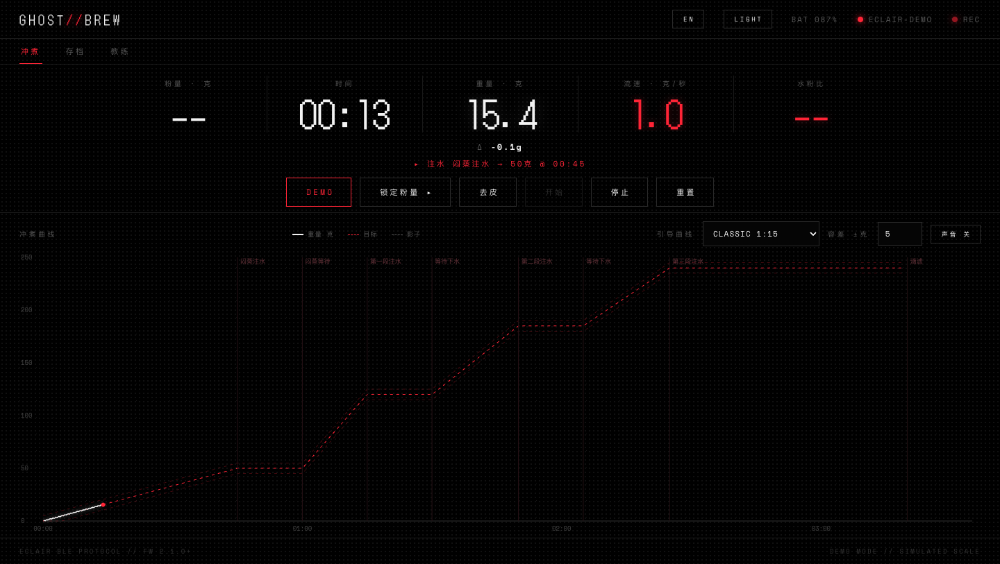

# GHOST//BREW

**手冲咖啡幽灵曲线教练** — 一个连接 AtomHeart Eclair 蓝牙电子秤的单文件网页应用。
倒一杯好咖啡,全程不用碰手机/App:连接、称豆、开始、停止,全部自动。

**在线使用:<https://ghost-brew.vercel.app/>**(Chrome / Edge,无需安装)



## 这是什么

对着一条"幽灵曲线"冲咖啡:App 把目标注水曲线(或你某次完美冲煮的历史曲线)画在图上作为影子,你实际的注水曲线实时叠上去,配合容差带、阶段提示和语音/蜂鸣提醒,让每一杯都复刻理想节奏。

整个 App 就是**一个 `index.html`**——没有构建工具、没有后端、没有依赖安装,数据全部存在浏览器本地(IndexedDB)。

## 怎么用

### 第一次使用(1 分钟)

1. **打开页面**:用 Chrome / Edge 打开 [在线地址](https://ghost-brew.vercel.app/)(Web Bluetooth 要求 HTTPS 或 `localhost`,Safari / Firefox 不支持)
2. **连接秤**:点左上角「连接」,在弹出的蓝牙列表里选择你的 `ECLAIR-XXXX`;秤需处于开机状态
3. **选一个配方**:内置 `CLASSIC 1:15` 和 `OREA` 两个预设,也可以稍后在配方编辑器里新建或粘贴文本导入
4. **冲一壶**:见下面的「日常冲煮」——结束后存档,下次就能把这条曲线设为目标(幽灵)

> 没有秤也能体验:在网址后加 `?demo` 打开,会模拟一台秤自动冲一壶。

### 日常冲煮(零操作)

配合 Eclair 秤的手冲模式,完整流程只需要动秤,不需要动 App:

1. **打开页面** —— 自动连接已配对过的秤(Web Bluetooth `getDevices()`)
2. **在秤上称豆** —— App 被动嗅探稳定重量,自动识别粉量(`~15.2` = 自动识别;也可手动「锁定粉量」)
3. **直接注水** —— 秤开始计时的瞬间,App 通过蓝牙计时状态消息(`C`)**跟随秤自动开始记录**;称豆、放滤杯等任何其他重量变化都不会误触发
4. **跟着提示冲** —— 五宫格大读数(粉量 · 时间 · 重量 · 流速 · 水粉比)+ 幽灵曲线 + 阶段进度(`→ 50克 · 还差 19.8克`)+ 语音/蜂鸣提醒
5. **移开滤杯** —— 秤自动停止计时,App 自动停止并弹出存档;命名保存后,这条历史曲线就能作为"影子"引导下一杯

### 配方

- **新建 / 编辑**:配方由若干阶段组成——注水段(到目标克重)与等待段(按秒倒计时);可设「设计粉量」(如 OREA 按 12g 设计),实际粉量不同时全部目标克数**自动等比缩放**,语音、图表、进度同步缩放
- **文本快速导入**:粘贴下面这种文本直接解析成配方,首行写 `粉量: 12` 自动识别设计粉量:

  ```
  粉量: 12
  闷蒸 0:45 50g
  注水到 120g
  等待 30s
  ```

- **JSON 导入 / 导出**:一键备份或分享配方
- **目标(幽灵)选择**:图表上的影子可以是配方目标曲线,也可以是任何一次已保存的历史冲煮

### 其他开关

| 按钮 | 作用 |
|---|---|
| 语言 | 中英双语界面 + 双语语音播报 |
| 主题 | 纯黑 / 米白,跟随偏好持久化 |
| 声音 | 语音 + 蜂鸣开关 |
| 去皮 / 开始 / 停止 | 远程操作秤(通常用不到——秤端操作 App 会自动跟随) |

偏好(语言、主题、声音、上次配方)全部存在浏览器本地。

## 功能

- **幽灵曲线教练**:目标曲线 + 容差带;脉冲式配方的阶段提示**按称重判定**——注水/闷蒸段在实际克重达到目标的瞬间才播报(½ 克容差吸收秤的延迟),等待段从上段结束起按时长倒计时;阶段行实时显示进度
- **比例配方**:一份配方通吃不同粉量,目标克数自动等比缩放
- **五宫格大读数**:粉量 · 时间 · 重量 · 流速 · 水粉比(水粉比基于自动识别的粉量实时计算)
- **跟随秤状态机**:订阅秤的计时状态通知(`C 0x43`),双向同步开始/停止;秤端开始/停止 App 必跟随
- **粉量自动嗅探**:空闲时检测 5–100g 的稳定重量平台并自动采用(滤杯+分享壶 >100g 不会误触发);也保留手动「锁定粉量」
- **语音 + 蜂鸣提醒**:中英双语播报;英文为完整句式("Pour to 40 grams." / "Stop pouring."),并按比例缩放后的实际克数播报;自动从系统语音库挑选自然声线(过滤 Whisper/Zarvox 这类整蛊音)
- **配方管理**:多配方(目标/编辑/复制/删除)、JSON 导入导出、文本快速导入;内置 CLASSIC 1:15 和 OREA 两个预设
- **冲煮存档**:每次冲煮自动记录(重量/流速采样、粉量、时长),可命名保存,历史曲线可作为"影子"再次引导
- **锚定压缩图表**:时间轴从 0 锚定、窗口只增不减,全程曲线(含目标线)始终完整在屏——无滑动丢历史;停止后定格为全量复盘视图
- **中英双语**、**暗色/亮色主题**、自动重连,偏好全部持久化
- **演示模式**:没有秤也能玩 —— 打开 `?demo` 会模拟一台秤并自动冲一壶

## 设计细节

- **动效**:按钮按压回弹、弹窗 `scale(.95)` 淡入、阶段切换闪现提示、冲煮完成的点阵粒子庆祝;全部遵循 `prefers-reduced-motion`(变柔,不归零)
- **可访问性**:双主题全部文字通过 WCAG AA 对比度(≥4.5:1,含 canvas 刻度/阶段名);全站字号地板 10px;hover 态仅在精确指针设备生效
- Nothing 风格极简:纯黑/米白双主题、点阵字体、单一红色强调

## 本地运行

```bash
cd ghost-brew
python3 -m http.server 8000
# 打开 http://localhost:8000
```

Web Bluetooth 要求 Chrome / Edge,且页面必须通过 `localhost` 或 HTTPS 访问。首次点击「连接」选择你的 `ECLAIR-XXXX` 秤;之后打开页面即自动连接。

## BLE 协议摘要

基于官方公开的 [Eclair 蓝牙协议](https://ef.atomheart.cn/eclair-scale-bluetooth-protocol.html)(设备名前缀 `ECLAIR-`):

| 方向 | 消息 | 头字节 | 内容 |
|---|---|---|---|
| 秤 → App | `W` | `0x57` | 重量 (int32 LE, mg) + 计时 (uint32 LE, ms) |
| 秤 → App | `F` | `0x46` | 流速 (int32 LE, mg/s) + 计时 (ms) |
| 秤 → App | `C` | `0x43` | 计时状态:`0x01` 开始 / `0x00` 停止(每次变化发 3 次) |
| 秤 → App | `B` | `0x42` | 电量百分比 |
| App → 秤 | `T` | `0x54` | 去皮(FW 2.1.0+ 不复位计时) |
| App → 秤 | `R` | `0x52` | 复位计时(计时运行中会被忽略,需先停止) |
| App → 秤 | `S` | `0x53` | 去皮 + 复位 + 开始计时 |
| App → 秤 | `E` | `0x45` | 停止计时 |

数据通道:`W`/`F` 走 DATA 特征值;`C`/`B` 与命令共用 CONFIG 特征值(记得同时订阅两个特征的 notify)。包格式 = 头字节 + 负载 + 负载 XOR 校验。

> 注:秤的手冲子页面状态(称豆/确定粉量/冲煮)与粉量**不会**通过蓝牙广播——协议里没有此类消息。App 的粉量自动嗅探正是为此设计的。

## 技术

- 单文件 HTML/CSS/JS,Canvas 绘制曲线(容器查询自适应字号,一屏显示)
- IndexedDB 三个仓库:`brews`(存档)、`recipes`(配方)、`kv`(偏好)
- 部署:GitHub `main` 推送即自动部署到 Vercel

---

## English

**Ghost Brew** — a ghost-curve coach for pour-over coffee, built as a single-file web app for the AtomHeart Eclair BLE scale. Brew against a target (or your best past brew) drawn as a shadow, with your live curve on top.

**Live: <https://ghost-brew.vercel.app/>** (Chrome/Edge)

**Quick start:**

1. Open the page in Chrome/Edge and hit **Connect** — pick your `ECLAIR-XXXX` scale (pairs once, auto-reconnects forever)
2. Pick a recipe (CLASSIC 1:15 and OREA ship built in) or paste a text recipe into quick-import
3. Weigh your beans on the scale — the dose is sniffed and adopted automatically
4. Just start pouring — recording follows the scale's own timer, with the ghost curve, live stage progress and voice cues guiding you
5. Lift the dripper off — the scale stops, the brew archives itself, and it can become the ghost for your next cup

No scale? Append `?demo` to the URL and a simulated scale brews a full cup.

- **Zero-touch workflow**: recording starts/stops by *following the scale's timer* (`C` notifications) — weighing beans or placing the dripper never false-triggers it
- **Weight-driven coaching**: pulse-pour stages announce the moment the scale actually hits the target grams (½g slack), waits count down by duration; live per-stage progress in the stage line
- **Ratio-based recipes**: set a design dose (e.g. OREA = 12g) and every stage target scales to your actual dose — voice prompts, chart targets and progress all scale together
- **Natural voice cues**: full-sentence English prompts with the scaled grams ("Pour to 40 grams."), best-match system voice per language (novelty voices filtered out)
- **Anchored compress-to-fit chart**: the whole brew — target included — is always fully on screen; freezes into a review view on stop
- Multi-recipe management with JSON import/export and a text quick-import; brew archive (IndexedDB); zh/en UI; dark/light themes, all text WCAG AA in both; motion respects `prefers-reduced-motion`

**Run locally:** serve the folder (`python3 -m http.server 8000`) and open it in Chrome/Edge — Web Bluetooth requires localhost or HTTPS.

Protocol credit: [AtomHeart Eclair BLE protocol](https://ef.atomheart.cn/eclair-scale-bluetooth-protocol.html).

## License

MIT
